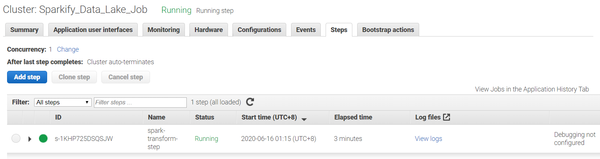
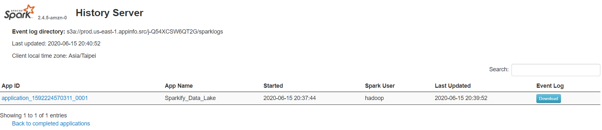
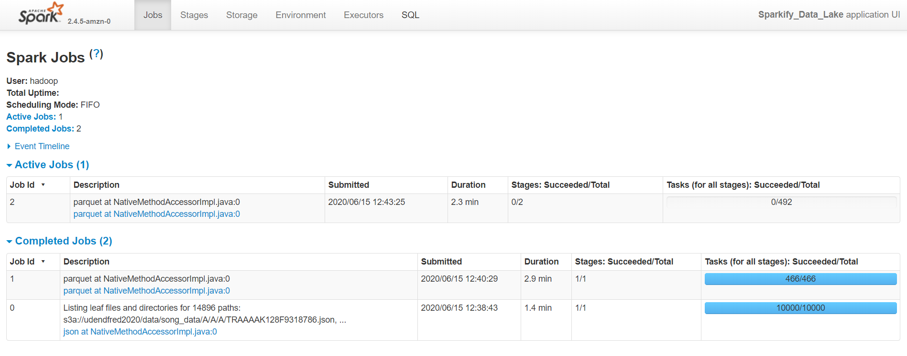
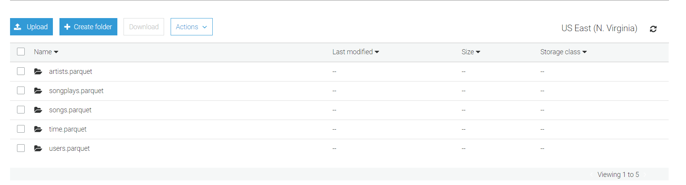

# Data Lake with Spark and EMR as a Step Function
In this project we will implement the following:
- Data lake using S3
- Building an ETL pipeline in Python for the data lake
- Load data from S3 and submit Spark jobs as a Step Function to an EMR cluster and write the results back to S3

# Introduction
A music streaming startup, Sparkify, has grown their user base and song database even more and want to move their data warehouse to a data lake. Their data resides in S3, in a directory of JSON logs on user activity on the app, as well as a directory with JSON metadata on the songs in their app.

As their data engineer, you are tasked with building an ETL pipeline that extracts their data from S3, processes them using Spark, and loads the data back into S3 as a set of dimensional tables. This will allow their analytics team to continue finding insights in what songs their users are listening to.

# Objectives
Our goal is to load data from S3, process the data into analytics tables using Spark, and load them back to S3. We will setup an AWS EMR cluster where we will run the Spark jobs.

## Datasets
There are two datasets *song_data* and *log_data*, both of which reside in S3.

**Song datasets**: all json files are nested in subdirectories under *s3a://udacity-dend/song_data*. 

Sample:

`
{"num_songs": 1, "artist_id": "ARGCY1Y1187B9A4FA5", "artist_latitude": 36.16778, "artist_longitude": -86.77836, "artist_location": "Nashville, TN.", "artist_name": "Gloriana", "song_id": "SOQOTLQ12AB01868D0", "title": "Clementina Santaf\u00e8", "duration": 153.33832, "year": 0}
`

**Log datasets**: all json files are nested in subdirectories under *s3a://udacity-dend/log_data*.

Sample:

`
{"artist":null,"auth":"Logged In","firstName":"Walter","gender":"M","itemInSession":0,"lastName":"Frye","length":null,"level":"free","location":"San Francisco-Oakland-Hayward, CA","method":"GET","page":"Home","registration":1540919166796.0,"sessionId":38,"song":null,"status":200,"ts":1541105830796,"userAgent":"\"Mozilla\/5.0 (Macintosh; Intel Mac OS X 10_9_4) AppleWebKit\/537.36 (KHTML, like Gecko) Chrome\/36.0.1985.143 Safari\/537.36\"","userId":"39"}
`

## Schema for Song Play Analysis
For this project, we will use Star Schema consisting of one **Fact** table and four **Dimensional** tables. We will be utilizing the **Schema-on-Read** functionality of Spark.

### Fact Table

**songplays** - records in log data associated with song plays i.e. records with page = `NextSong`

- songplay_id IntegerType
- start_time TimestampType
- user_id IntegerType
- level StringType
- song_id StringType
- artist_id StringType
- session_id IntegerType
- location StringType
- user_agent StringType

### Dimension Tables

**users** - users in the app
- user_id IntegerType
- first_name StringType
- last_name StringType
- gender StringType
- level StringType

**songs** - songs in the music database
- song_id StringType
- title StringType
- artist_id StringType
- year IntegerType
- duration FloatType

**artists** - artists in the music database
- artist_id StringType
- name StringType
- location StringType
- latitude FloatType
- longitude FloatType

**time** - timestamps of records in **songplays** broken down into specific units
- start_time TimestampType
- hour IntegerType
- day IntegerType
- week IntegerType
- month IntegerType
- year IntegerType
- weekday StringType

## Project Resources

Here are the files and scripts that we will use
1. **dl.cfg** is the configuration file that contains the path for the S3 bucket as well as AWS secrets to create an EMR cluster.
2. **etl.py** is the main script that gets data from an S3 bucket, loads it into Spark and transforms the data into fact and dimension tables, then loads the data back into S3.
3. **run.py** creates an EMR cluster, copies **etl.py** and **dl.cfg** into S3, then submits **etl.py** as a Spark job into the EMR cluster. The cluster is designed to auto-terminate as it is created as an AWS Step Function.

## Procedure
1. Fill-out the necessary information on the configuration file template **template_dl.cfg** and save it as **dl.cfg**.
2. Create an EMR cluster by running
```
python run.py
```
3. This command creates the EMR cluster, installs the necessary JARs to trigger a step function parameterized by the arguments. For the cluster, we will be utilizing one master node and three slave nodes.
```
cluster_id = emr.run_job_flow(
        Name = "Sparkify_Data_Lake_Job",
        LogUri = LogUri,
        ReleaseLabel = "emr-5.30.0",
        Applications = [
            {
                "Name": "Spark"
            }
        ],
        Instances = {
            "InstanceGroups": [
                {
                    "Name": "Master nodes",
                    "Market": "ON_DEMAND",
                    "InstanceRole": "MASTER",
                    "InstanceType": "m5.xlarge",
                    "InstanceCount": 1
                },
                {
                    "Name": "Slave nodes",
                    "Market": "ON_DEMAND",
                    "InstanceRole": "CORE",
                    "InstanceType": "m5.xlarge",
                    "InstanceCount": 3
                }
            ],
            "Ec2KeyName": "spark-pem",
            "KeepJobFlowAliveWhenNoSteps": False,
            "TerminationProtected": False
        },
        VisibleToAllUsers = True,
        JobFlowRole = "EMR_EC2_DefaultRole",
        ServiceRole = "EMR_DefaultRole",
        Steps = [
            {
                "Name" : "spark-transform-step",
                "ActionOnFailure": "CONTINUE",
                "HadoopJarStep" : {
                    "Jar": "s3n://elasticmapreduce/libs/script-runner/script-runner.jar",
                    "Args": [
                        "/usr/bin/spark-submit", "--deploy-mode", "cluster",
                        "--driver-memory", "10g", "--num-executors", "5",
                        "--executor-cores", "2", "--executor-memory", "10g",
                        "--py-files", config_path, file_path
                    ]
                }
            }
        ]
    )
```
4. By running **run.py**, this will copy **etl.py** and **dl.cfg** into the target S3 bucket, then creates an EMR cluster with a Step Function that submits **etl.py** as a Spark job into the cluster and runs it. This can be confirmed in the **Steps** tab of the EMR cluster. The cluster auto-terminates when the job is finished as indicated in `"TerminationProtected": False`.

5. Confirm that the script is running by checking the **Spark history server** application user interface in the created EMR cluster.

6. You can drill down to the stages and tasks involved in the Spark jobs by going into the **Stages** tab.

7. Check the target S3 bucket and confirm that the tables have been written.

